# LaChaudiere.app — Application Mobile Flutter

## Présentation

LaChaudiere.app est une application mobile développée avec **Flutter** dans le cadre de la SAE Atelier de développement d’application web du Semestre 4 du BUT Informatique (IUT Nancy-Charlemagne).

L’application permet de parcourir et visualiser les événements culturels proposés par La Chaudière, via une interface mobile ergonomique.

Elle consomme les données fournies par le backend **LaChaudiereAgenda.core** via une API REST, récupérant les événements au format JSON et les affichant dans une interface "master / détail".

---

## Objectifs pédagogiques

- Mettre en pratique les appels asynchrones vers une API REST dans Flutter.
- Implémenter une navigation fluide et une interface utilisateur adaptée aux mobiles.
- Gérer la persistance locale des données via SQLite.
- Utiliser un provider pour gérer le thème et les états applicatifs.
- Appliquer des techniques avancées comme le tri, filtrage, recherche, et personnalisation.

---

## Fonctionnalités réalisées

1. **Personnalisation de l’application**
    - Création d’une icône personnalisée.
    - Splash screen animé au lancement.
    
2. **Navigation et affichage**
    - Liste des événements affichée en ordre alphabétique.
      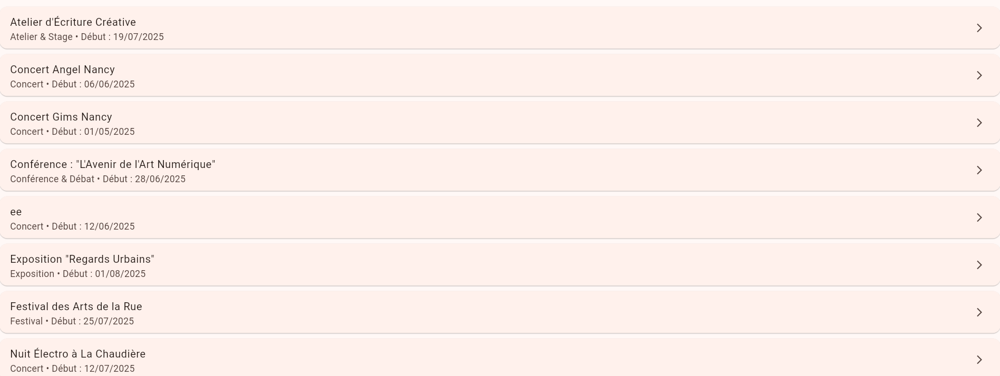
    - Pour chaque événement, affichage du titre, de la catégorie, et des dates.
      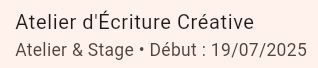
    - Recherche d’un événement par titre.
      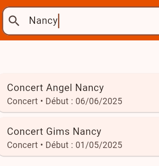
    - Affichage détaillé des informations d’un événement en cliquant dessus (mode master/détail).
      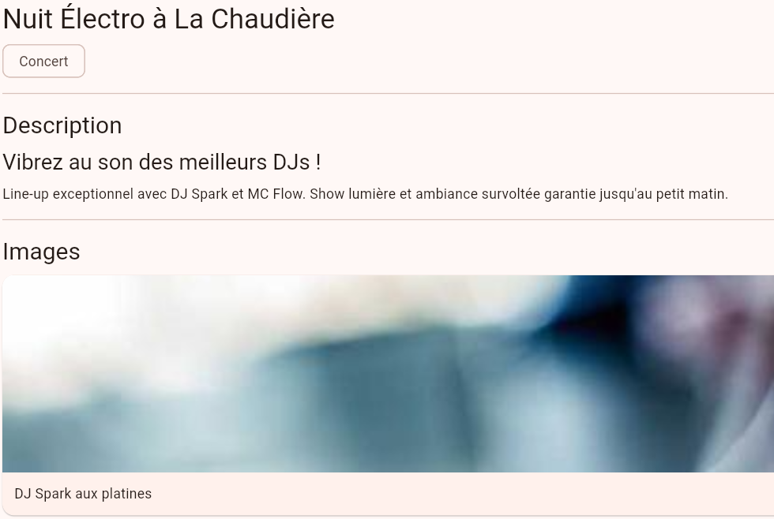
3. **Fonctions étendues**
    - Filtrage des événements par catégorie.
      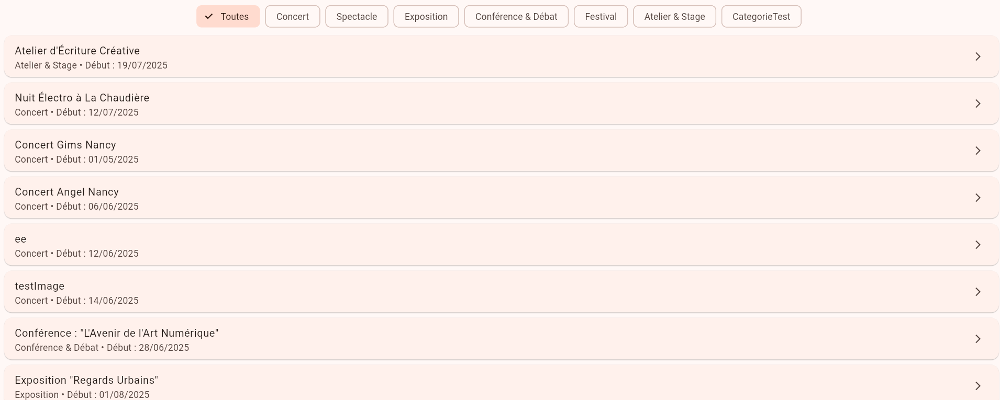
      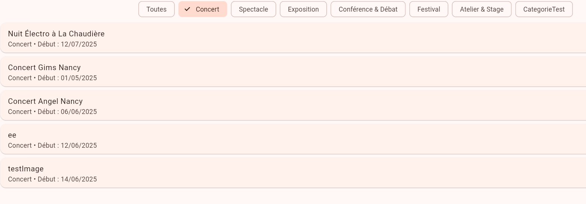
    - Tri des événements selon plusieurs critères :
        - Date ascendante.
         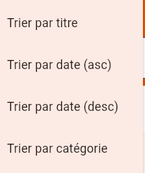
         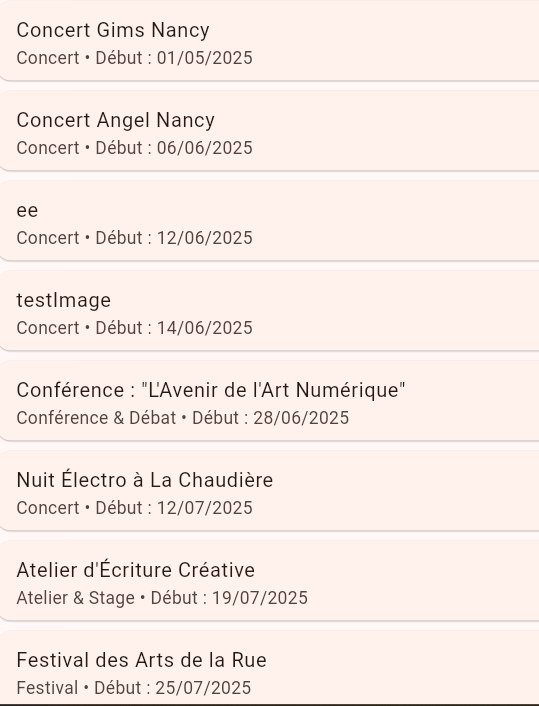
        - Date descendante.
          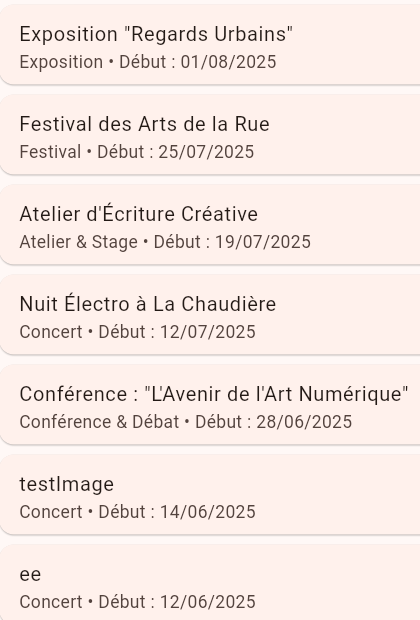
        - Titre (ordre alphabétique).
          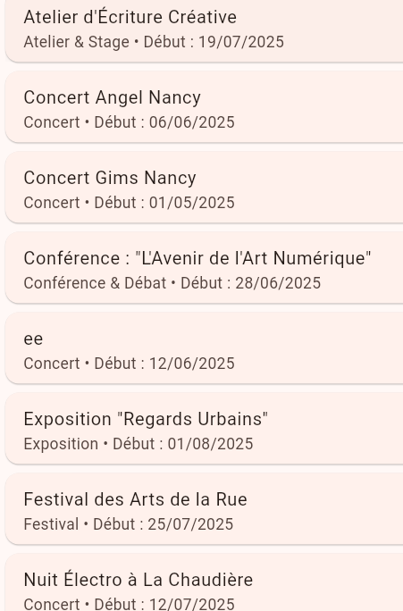
        - Catégorie (ordre alphabétique).
          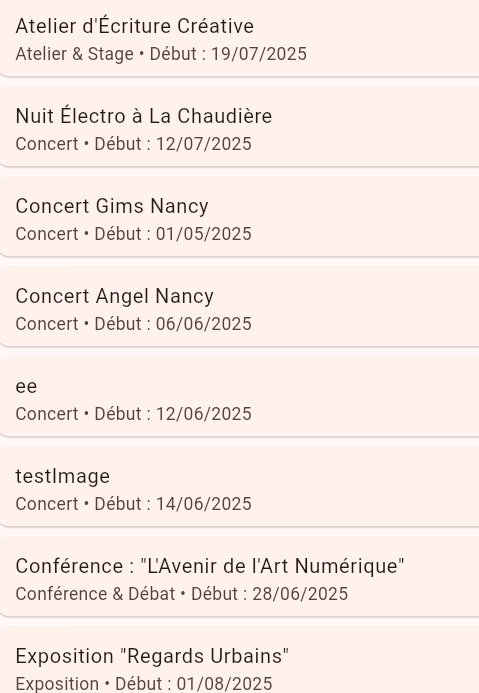
    - Gestion d’un thème clair / sombre via un provider.
    - Persistance des données locales via SQLite.

---

## Architecture et organisation du code

- Code structuré en modules Dart clairs.
- Usage des widgets Flutter pour la construction de l’interface.
- Appels asynchrones à l’API gérés avec `Future` et `FutureBuilder`.
- Gestion d’état via Provider pour thème et filtres.
- Base de données locale SQLite pour stocker les événements.

---

## Installation et lancement

### Prérequis

- Flutter SDK installé : https://flutter.dev/docs/get-started/install
- Android Studio / Visual Studio Code (optionnel mais recommandé)
- Émulateur ou appareil physique connecté
